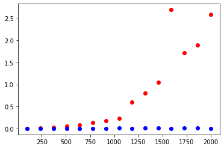

# Abstract

In this document, we will discuss multiple different questions pertaining to the SARS-CoV-2 genome. Tasks 1 and 2 will go over the different methods of computationally discovering frequent k-mer patterns. The algorithims of counting these patterns will be implemented through the FrequentWords() and BetterFrequentWords() approaches. Task 3 will allow us to generate random DNA sequences of various lengths. Task 4 will provide graphs for the runtimes of the algorithims implemented in Task 1 and 2, which will be compared. Task 5 will use our algorithims to report the most frequent k-mers of varrying sizes in the coronavirus 2 genome. Finally, Task 6 will allow us to determine which genes certain k-mers belong to and whether or not they are in an intergeneic region.

# Introduction

In this assignment we use the field of bioinformatics to determine different attributes of the SARS-CoV 2 genome. The first half of the assignment uses algorithms to process genome sequences and the second half utilizes those algorithms in order to compute frequent k-mers in the SARS-CoV 2 genome. All code is implemented using python.

# **Methods**

-   How to compile the code submitted:

    To compile the code provided you first need to download the zip folder which contains a python folder named assignment1.py along with a text document named sequence.txt. If you are running on an IDE such as Visual Studio Code you will need to install matplotlib, pandas, and numpy using pip and then you will be able to compile the code. Alternatively, you can also use the link to the Google colab which will allow you to run the file without having to download any libraries, but will not provide the genome sequences relative to the sequences.txt file required for task 5, that is only available via download.

-   Example on how to run code:

    <https://drive.google.com/drive/folders/1wgVmGhylnQw9NBOBQCg7qjH_aP4rE_34?usp=sharing>

# **Results**

frequent 3-mers in Covid genome: [[('T', 'T', 'T'), [[106, 109], [138, 141], [174, 177], [299, 302], [338, 341], [387, 390], [417, 420], [425, 428], [426, 429], [458, 461], [547, 550], [548, 551], [798, 801], [840, 843], [841, 844], [1016, 1019], [1036, 1039], [1138, 1141], [1139, 1142], [1164, 1167], [1193, 1196], [1194, 1197], [1200, 1203], [1264, 1267], [1329, 1332], [1385, 1388], [1386, 1389], [1407, 1410], [1408, 1411], [1424, 1427], [1484, 1487], [1599, 1602], [1784, 1787], [1813, 1816], [1814, 1817], [1823, 1826], [1824, 1827], [1825, 1828], [1844, 1847], [1845, 1848], [1865, 1868], [1911, 1914], [1912, 1915], [1986, 1989], [1994, 1997], [2029, 2032], [2030, 2033], [2071, 2074], [2072, 2075], [2108, 2111], [2158, 2161], [2241, 2244], [2251, 2254], [2295, 2298], [2314, 2317], [2344, 2347], [2429, 2432], [2448, 2451], [2449, 2452], [2450, 2453], [2456, 2459], [2507, 2510], [2521, 2524], [2684, 2687], [2747, 2750], [2873, 2876], [2874, 2877], [2927, 2930], [2928, 2931], [3049, 3052], [3092, 3095], [3126, 3129], [3144, 3147], [3174, 3177], [3227, 3230], [3283, 3286], [3490, 3493], [3491, 3494], [3502, 3505], [3599, 3602], [3724, 3727], [3725, 3728], [3825, 3828], [3826, 3829], [3873, 3876], [3874, 3877], [3875, 3878], [3898, 3901], [3906, 3909], [3948, 3951], [3976, 3979], [3984, 3987], [3985, 3988], [3986, 3989], [4057, 4060], [4183, 4186], [4251, 4254], [4305, 4308], [4306, 4309], [4370, 4373], [4421, 4424], [4480, 4483], [4481, 4484], [4536, 4539], [4546, 4549], [4621, 4624], [4690, 4693], [4691, 4694], [4696, 4699], [4697, 4700], [4802, 4805], [4859, 4862], [4930, 4933], [4931, 4934], [5010, 5013], [5089, 5092], [5111, 5114], [5115, 5118], [5144, 5147], [5214, 5217], [5228, 5231], [5287, 5290], [5288, 5291], [5294, 5297], [5295, 5298], [5328, 5331], [5329, 5332], [5359, 5362], [5360, 5363], [5426, 5429], [5506, 5509], [5567, 5570], [5568, 5571], [5646, 5649], [5660, 5663], [5762, 5765], [5852, 5855], [5853, 5856], [5904, 5907], [5976, 5979], [5998, 6001], [6042, 6045], [6043, 6046], [6109, 6112], [6165, 6168], [6229, 6232], [6230, 6233], [6236, 6239], [6257, 6260], [6268, 6271], [6324, 6327], [6325, 6328], [6326, 6329], [6384, 6387], [6385, 6388], [6423, 6426], [6490, 6493], [6525, 6528], [6704, 6707], [6810, 6813], [6834, 6837], [6889, 6892], [6890, 6893], [6938, 6941], [6949, 6952], [6971, 6974], [6975, 6978], [6980, 6983], [7002, 7005], [7003, 7006], [7085, 7088], [7086, 7089], [7103, 7106], [7111, 7114], [7127, 7130], [7128, 7131], [7129, 7132], [7153, 7156], [7158, 7161], [7159, 7162], [7160, 7163], [7174, 7177], [7187, 7190], [7209, 7212], [7217, 7220], [7218, 7221], [7230, 7233], [7273, 7276], [7332, 7335], [7346, 7349], [7355, 7358], [7373, 7376], [7396, 7399], [7403, 7406], [7404, 7407], [7416, 7419], [7425, 7428], [7426, 7429], [7447, 7450], [7448, 7451], [7449, 7452], [7463, 7466], [7464, 7467], [7474, 7477], [7475, 7478], [7476, 7479], [7514, 7517], [7515, 7518], [7516, 7519], [7525, 7528], [7526, 7529], [7537, 7540], [7538, 7541], [7597, 7600], [7627, 7630], [7636, 7639], [7637, 7640], [7770, 7773], [7771, 7774], [7800, 7803], [7801, 7804], [7861, 7864], [7900, 7903], [7981, 7984], [7986, 7989], [8033, 8036], [8034, 8037], [8099, 8102], [8100, 8103], [8101, 8104], [8151, 8154], [8247, 8250], [8269, 8272], [8270, 8273], [8280, 8283], [8281, 8284], [8374, 8377], [8375, 8378], [8379, 8382], [8399, 8402], [8611, 8614], [8633, 8636], [8700, 8703], [8701, 8704], [8826, 8829], [8827, 8830], [8842, 8845], [8843, 8846], [8849, 8852], [8889, 8892], [8890, 8893], [8964, 8967], [8965, 8968], [8986, 8989], [8987, 8990], [8999, 9002], [9077, 9080], [9078, 9081], [9092, 9095], [9130, 9133], [9131, 9134], [9132, 9135], [9138, 9141], [9152, 9155], [9153, 9156], [9154, 9157], [9212, 9215], [9231, 9234], [9232, 9235], [9252, 9255], [9253, 9256], [9333, 9336], [9382, 9385], [9427, 9430], [9428, 9431], [9481, 9484], [9533, 9536], [9545, 9548], [9546, 9549], [9570, 9573], [9586, 9589], [9616, 9619], [9686, 9689], [9687, 9690], [9696, 9699], [9707, 9710], [9708, 9711], [9735, 9738], [9743, 9746], [9777, 9780], [9788, 9791], [9809, 9812], [9821, 9824], [9839, 9842], [9840, 9843], [9858, 9861], [9862, 9865], [9863, 9866], [9864, 9867], [9865, 9868], [9902, 9905], [9911, 9914], [9937, 9940], [9943, 9946], [9956, 9959], [9970, 9973], [10000, 10003], [10010, 10013], [10015, 10018], [10023, 10026], [10024, 10027], [10049, 10052], [10050, 10053], [10051, 10054], [10132, 10135], [10151, 10154], [10152, 10155], [10251, 10254], [10287, 10290], [10288, 10291], [10300, 10303], [10301, 10304], [10384, 10387], [10403, 10406], [10465, 10468], [10492, 10495], [10606, 10609], [10632, 10635], [10633, 10636], [10634, 10637], [10673, 10676], [10699, 10702], [10748, 10751], [10749, 10752], [10775, 10778], [10776, 10779], [10777, 10780], [10843, 10846], [10844, 10847], [10854, 10857], [10855, 10858], [10914, 10917], [10915, 10918], [10971, 10974], [10992, 10995], [11063, 11066], [11087, 11090], [11088, 11091], [11161, 11164], [11178, 11181], [11186, 11189], [11187, 11190], [11219, 11222], [11279, 11282], [11280, 11283], [11291, 11294], [11292, 11295], [11297, 11300], [11298, 11301], [11323, 11326], [11330, 11333], [11331, 11334], [11332, 11335], [11333, 11336], [11334, 11337], [11335, 11338], [11351, 11354], [11352, 11355], [11353, 11356], [11359, 11362], [11360, 11363], [11390, 11393], [11391, 11394], [11403, 11406], [11424, 11427], [11432, 11435], [11436, 11439], [11437, 11440], [11438, 11441], [11469, 11472], [11470, 11473], [11542, 11545], [11551, 11554], [11552, 11555], [11678, 11681], [11687, 11690], [11703, 11706], [11717, 11720], [11783, 11786], [11784, 11787], [11785, 11788], [11802, 11805], [11803, 11806], [11804, 11807], [11830, 11833], [11831, 11834], [11872, 11875], [11879, 11882], [11892, 11895], [11893, 11896], [11894, 11897], [11908, 11911], [11917, 11920], [11918, 11921], [11922, 11925], [11938, 11941], [11958, 11961], [11973, 11976], [11987, 11990], [12155, 12158], [12156, 12159], [12255, 12258], [12268, 12271], [12277, 12280], [12283, 12286], [12284, 12287], [12289, 12292], [12323, 12326], [12376, 12379], [12403, 12406], [12404, 12407], [12485, 12488], [12507, 12510], [12636, 12639], [12637, 12640], [12905, 12908], [12932, 12935], [13082, 13085], [13106, 13109], [13115, 13118], [13189, 13192], [13227, 13230], [13235, 13238], [13282, 13285], [13352, 13355], [13361, 13364], [13362, 13365], [13511, 13514], [13575, 13578], [13576, 13579], [13638, 13641], [13639, 13642], [13749, 13752], [13750, 13753], [13751, 13754], [13761, 13764], [13832, 13835], [13833, 13836], [13862, 13865], [13863, 13866], [13923, 13926], [13939, 13942], [13960, 13963], [13989, 13992], [13996, 13999], [14037, 14040], [14043, 14046], [14124, 14127], [14133, 14136], [14134, 14137], [14203, 14206], [14228, 14231], [14229, 14232], [14291, 14294], [14392, 14395], [14401, 14404], [14489, 14492], [14547, 14550], [14588, 14591], [14599, 14602], [14600, 14603], [14644, 14647], [14679, 14682], [14686, 14689], [14687, 14690], [14717, 14720], [14718, 14721], [14743, 14746], [14761, 14764], [14768, 14771], [14845, 14848], [14846, 14849], [14931, 14934], [14932, 14935], [14964, 14967], [14965, 14968], [14988, 14991], [14989, 14992], [15011, 15014], [15028, 15031], [15032, 15035], [15071, 15074], [15160, 15163], [15187, 15190], [15259, 15262], [15260, 15263], [15266, 15269], [15292, 15295], [15331, 15334], [15332, 15335], [15464, 15467], [15568, 15571], [15709, 15712], [15836, 15839], [15837, 15840], [15838, 15841], [15845, 15848], [15879, 15882], [15880, 15883], [15925, 15928], [15940, 15943], [15981, 15984], [15993, 15996], [15994, 15997], [16005, 16008], [16017, 16020], [16056, 16059], [16106, 16109], [16119, 16122], [16137, 16140], [16138, 16141], [16139, 16142], [16197, 16200], [16198, 16201], [16291, 16294], [16292, 16295], [16348, 16351], [16407, 16410], [16412, 16415], [16526, 16529], [16527, 16530], [16585, 16588], [16713, 16716], [16755, 16758], [16808, 16811], [16809, 16812], [16834, 16837], [16835, 16838], [16836, 16839], [16841, 16844], [16885, 16888], [16932, 16935], [16933, 16936], [16965, 16968], [16966, 16969], [16967, 16970], [17004, 17007], [17116, 17119], [17171, 17174], [17202, 17205], [17246, 17249], [17247, 17250], [17360, 17363], [17361, 17364], [17447, 17450], [17448, 17451], [17550, 17553], [17605, 17608], [17606, 17609], [17649, 17652], [17650, 17653], [17697, 17700], [17708, 17711], [17730, 17733], [17946, 17949], [17951, 17954], [17999, 18002], [18008, 18011], [18009, 18012], [18036, 18039], [18117, 18120], [18121, 18124], [18161, 18164], [18162, 18165], [18269, 18272], [18307, 18310], [18331, 18334], [18349, 18352], [18387, 18390], [18416, 18419], [18506, 18509], [18573, 18576], [18574, 18577], [18613, 18616], [18710, 18713], [18716, 18719], [18728, 18731], [18729, 18732], [18730, 18733], [18795, 18798], [18796, 18799], [18797, 18800], [18835, 18838], [18948, 18951], [18969, 18972], [18993, 18996], [18994, 18997], [19051, 19054], [19100, 19103], [19121, 19124], [19148, 19151], [19149, 19152], [19261, 19264], [19560, 19563], [19561, 19564], [19603, 19606], [19611, 19614], [19665, 19668], [19702, 19705], [19703, 19706], [19717, 19720], [19718, 19721], [19726, 19729], [19742, 19745], [19743, 19746], [19744, 19747], [19848, 19851], [19931, 19934], [19944, 19947], [19955, 19958], [19982, 19985], [19983, 19986], [20000, 20003], [20015, 20018], [20016, 20019], [20040, 20043], [20069, 20072], [20090, 20093], [20126, 20129], [20162, 20165], [20169, 20172], [20222, 20225], [20303, 20306], [20346, 20349], [20366, 20369], [20367, 20370], [20368, 20371], [20369, 20372], [20453, 20456], [20585, 20588], [20602, 20605], [20612, 20615], [20642, 20645], [20714, 20717], [20724, 20727], [20725, 20728], [20748, 20751], [20779, 20782], [20780, 20783], [20794, 20797], [20795, 20798], [20809, 20812], [20810, 20813], [20843, 20846], [20897, 20900], [20913, 20916], [20914, 20917], [20940, 20943], [20951, 20954], [20991, 20994], [20996, 20999], [21003, 21006], [21032, 21035], [21033, 21036], [21091, 21094], [21211, 21214], [21260, 21263], [21261, 21264], [21304, 21307], [21305, 21308], [21361, 21364], [21384, 21387], [21500, 21503], [21501, 21504], [21502, 21505], [21503, 21506], [21514, 21517], [21522, 21525], [21596, 21599], [21635, 21638], [21671, 21674], [21672, 21675], [21673, 21676], [21747, 21750], [21748, 21751], [21789, 21792], [21793, 21796], [21808, 21811], [21844, 21847], [21873, 21876], [21874, 21877], [21931, 21934], [21971, 21974], [21975, 21978], [21976, 21979], [21977, 21980], [21984, 21987], [21985, 21988], [22061, 22064], [22075, 22078], [22093, 22096], [22094, 22097], [22109, 22112], [22110, 22113], [22140, 22143], [22144, 22147], [22145, 22148], [22205, 22208], [22226, 22229], [22239, 22242], [22243, 22246], [22244, 22247], [22285, 22288], [22286, 22289], [22287, 22290], [22298, 22301], [22369, 22372], [22375, 22378], [22376, 22379], [22392, 22395], [22393, 22396], [22401, 22404], [22449, 22452], [22475, 22478], [22476, 22479], [22496, 22499], [22497, 22500], [22529, 22532], [22549, 22552], [22555, 22558], [22575, 22578], [22576, 22579], [22609, 22612], [22633, 22636], [22634, 22637], [22635, 22638], [22642, 22645], [22660, 22663], [22689, 22692], [22697, 22700], [22706, 22709], [22721, 22724], [22800, 22803], [22801, 22804], [22932, 22935], [22966, 22969], [22992, 22995], [22993, 22996], [23003, 23006], [23004, 23007], [23005, 23008], [23020, 23023], [23031, 23034], [23103, 23106], [23104, 23107], [23111, 23114], [23112, 23115], [23157, 23160], [23182, 23185], [23269, 23272], [23270, 23273], [23352, 23355], [23375, 23378], [23376, 23379], [23390, 23393], [23442, 23445], [23443, 23446], [23461, 23464], [23476, 23479], [23531, 23534], [23532, 23535], [23560, 23563], [23585, 23588], [23610, 23613], [23625, 23628], [23665, 23668], [23674, 23677], [23684, 23687], [23765, 23768], [23766, 23769], [23825, 23828], [23898, 23901], [23919, 23922], [23920, 23923], [23921, 23924], [23941, 23944], [24148, 24151], [24149, 24152], [24223, 24226], [24254, 24257], [24255, 24258], [24273, 24276], [24274, 24277], [24275, 24278], [24297, 24300], [24342, 24345], [24343, 24346], [24344, 24347], [24363, 24366], [24389, 24392], [24390, 24393], [24398, 24401], [24399, 24402], [24404, 24407], [24405, 24408], [24406, 24409], [24451, 24454], [24467, 24470], [24468, 24471], [24552, 24555], [24566, 24569], [24582, 24585], [24583, 24586], [24593, 24596], [24667, 24670], [24697, 24700], [24721, 24724], [24785, 24788], [24820, 24823], [24882, 24885], [24915, 24918], [24916, 24919], [24926, 24929], [24935, 24938], [24936, 24939], [24951, 24954], [25019, 25022], [25134, 25137], [25135, 25138], [25136, 25139], [25255, 25258], [25278, 25281], [25296, 25299], [25321, 25324], [25338, 25341], [25339, 25342], [25340, 25343], [25376, 25379], [25425, 25428], [25435, 25438], [25481, 25484], [25482, 25485], [25511, 25514], [25594, 25597], [25666, 25669], [25676, 25679], [25677, 25680], [25720, 25723], [25786, 25789], [25857, 25860], [25861, 25864], [25894, 25897], [25933, 25936], [25934, 25937], [25979, 25982], [26018, 26021], [26019, 26022], [26020, 26023], [26090, 26093], [26094, 26097], [26114, 26117], [26124, 26127], [26136, 26139], [26137, 26140], [26168, 26171], [26169, 26172], [26179, 26182], [26186, 26189], [26214, 26217], [26237, 26240], [26243, 26246], [26276, 26279], [26292, 26295], [26293, 26296], [26298, 26301], [26395, 26398], [26685, 26688], [26730, 26733], [26772, 26775], [26773, 26776], [26774, 26777], [26782, 26785], [26883, 26886], [26884, 26887], [26885, 26888], [26891, 26894], [26969, 26972], [26970, 26973], [26971, 26974], [26977, 26980], [26985, 26988], [26990, 26993], [26991, 26994], [27073, 27076], [27094, 27097], [27108, 27111], [27132, 27135], [27133, 27136], [27134, 27137], [27155, 27158], [27156, 27159], [27183, 27186], [27192, 27195], [27193, 27196], [27209, 27212], [27299, 27302], [27309, 27312], [27532, 27535], [27582, 27585], [27583, 27586], [27661, 27664], [27690, 27693], [27705, 27708], [27750, 27753], [27751, 27754], [27758, 27761], [27764, 27767], [27805, 27808], [27895, 27898], [27896, 27899], [27932, 27935], [27971, 27974], [27972, 27975], [28019, 28022], [28043, 28046], [28058, 28061], [28076, 28079], [28077, 28080], [28129, 28132], [28172, 28175], [28184, 28187], [28185, 28188], [28186, 28189], [28210, 28213], [28221, 28224], [28259, 28262], [28278, 28281], [28286, 28289], [28287, 28290], [28288, 28291], [28295, 28298], [28311, 28314], [28312, 28315], [28331, 28334], [28332, 28335], [28395, 28398], [28402, 28405], [28403, 28406], [28435, 28438], [28452, 28455], [28558, 28561], [28633, 28636], [28641, 28644], [28647, 28650], [28648, 28651], [28715, 28718], [28716, 28719], [28717, 28720], [28743, 28746], [28744, 28747], [28750, 28753], [28823, 28826], [28907, 28910], [29105, 29108], [29443, 29446], [29604, 29607], [29641, 29644], [29642, 29645], [29706, 29709], [29823, 29826], [29840, 29843], [29841, 29844], [29997, 30000], [30093, 30096], [30094, 30097], [30100, 30103], [30101, 30104], [30107, 30110], [30180, 30183], [30247, 30250], [30248, 30251], [30344, 30347], [30368, 30371], [30369, 30372]]]]

frequent 6-mers in Covid genome: [[('T', 'T', 'G', 'T', 'T', 'A'), [[1387, 1393], [1475, 1481], [2336, 2342], [3581, 3587], [4176, 4182], [4229, 4235], [4761, 4767], [5475, 5481], [5854, 5860], [6403, 6409], [6903, 6909], [7746, 7752], [8035, 8041], [8732, 8738], [8778, 8784], [9287, 9293], [10052, 10058], [10647, 10653], [10778, 10784], [11194, 11200], [11266, 11272], [11439, 11445], [11901, 11907], [13190, 13196], [14457, 14463], [14548, 14554], [15192, 15198], [19354, 19360], [19719, 19725], [21636, 21642], [21925, 21931], [21946, 21952], [22328, 22334], [22349, 22355], [23448, 23454], [24893, 24899], [26314, 26320], [26626, 26632], [26854, 26860]]]]

frequent 9-mers in Covid genome: [[('G', 'A', 'T', 'G', 'G', 'T', 'G', 'T', 'T'), [[6099, 6108], [14749, 14758], [20104, 20113], [20552, 20561], [22232, 22241]]], [('A', 'T', 'G', 'G', 'T', 'G', 'T', 'T', 'G'), [[6100, 6109], [20105, 20114], [20553, 20562], [23429, 23438], [23490, 23499]]], [('T', 'A', 'A', 'T', 'G', 'G', 'T', 'G', 'T'), [[7750, 7759], [10002, 10011], [20417, 20426], [23427, 23436], [23488, 23497]]], [('A', 'A', 'T', 'G', 'G', 'T', 'G', 'T', 'T'), [[7751, 7760], [10003, 10012], [20418, 20427], [23428, 23437], [23489, 23498]]], [('G', 'T', 'G', 'T', 'T', 'T', 'A', 'T', 'T'), [[9806, 9815], [22072, 22081], [22236, 22245], [22398, 22407], [23895, 23904]]], [('T', 'A', 'A', 'A', 'C', 'G', 'A', 'A', 'C'), [[25841, 25850], [26945, 26954], [27873, 27882], [28380, 28389], [28757, 28766]]]]

frequent 12-mers in Covid genome: [[('G', 'T', 'T', 'G', 'A', 'T', 'G', 'G', 'T', 'G', 'T', 'T'), [[14746, 14758], [20101, 20113], [20549, 20561]]]]

frequent 15-mers in Covid genome: [[('T', 'T', 'G', 'C', 'A', 'G', 'A', 'G', 'T', 'G', 'G', 'T', 'T', 'T', 'T'), [[7436, 7451], [10289, 10304]]], [('A', 'A', 'A', 'G', 'T', 'T', 'G', 'A', 'T', 'G', 'G', 'T', 'G', 'T', 'T'), [[20098, 20113], [20546, 20561]]], [('A', 'A', 'G', 'T', 'T', 'G', 'A', 'T', 'G', 'G', 'T', 'G', 'T', 'T', 'G'), [[20099, 20114], [20547, 20562]]], [('T', 'A', 'A', 'A', 'C', 'G', 'A', 'A', 'C', 'A', 'T', 'G', 'A', 'A', 'A'), [[27873, 27888], [28380, 28395]]]]

frequent 13-mers in Covid genome:\
[[('T', 'G', 'A', 'T', 'G', 'G', 'T', 'A', 'A', 'C', 'A', 'A', 'A'), [[2817, 2830], [15889, 15902]]], [('C', 'T', 'T', 'C', 'A', 'C', 'A', 'C', 'T', 'C', 'A', 'A', 'A'), [[2836, 2849], [28225, 28238]]], [('C', 'A', 'A', 'T', 'T', 'A', 'T', 'T', 'A', 'T', 'A', 'A', 'G'), [[6138, 6151], [20532, 20545]]]

    (There are more, to see please run code)

Testing FrequentWords(Task1) with string:

GGGATCACGTGGTTGATCCG ['GAT', 'ATC']

Testing BetterFrequentWords(Task2) with string:

TGTGCCGGCGCAACACTTGC [[('T', 'G', 'C'), [[3, 6], [18, 21]]]]

This graph displays the runtime of the FrequentWords() method in red and the BetterFrequentWords() method in blue

# Discussion

Our biggest struggle was having the correct path on our living document. While running our code we are able to see the exponential runtime of FREQUENTWORDS() compared to the linear runtime of BETTERFREQUENTWORDS(). Not only in run time we were able to see the significant decrease of the amount of kmers found as we increased our number to 15. Even with 15 k-mer, we still see a large amount of found k-mers within our sequence.

# Distribution of Work

Jason and Calicia worked on Task 1,2,3, and the write up page. Rahgda worked on Task 5,6. We worked together using our different backgrounds and strengths to help understand the data we collected with k-mers and the biological understanding of the SARS-CoV 2 genome. We used Github, Google Colab, and Rstudio to develop and share our updated work and data.

# References

<https://www.ncbi.nlm.nih.gov/nuccore/NC_045512.2?report=fasta>

<https://www.datacamp.com/tutorial/using-both-python-r>

<https://matplotlib.org/stable/tutorials/colors/colors.html>
