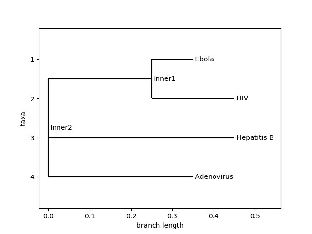

# **Abstract**

This document describes a Python script for performing various tasks
related to bioinformatics. The first task involves calculating the
Hamming distance between pairs of DNA sequences in a FASTA file, and
outputting the resulting distance matrix to a CSV file. The second task
involves aligning the sequences in the file, calculating pairwise
distances using the identity metric, and constructing a phylogenetic
tree based on those distances. The third task involves computing the
ancestral DNA sequences at each node of the phylogenetic tree, using the
most common nucleotide at each position. The fourth task involves
identifying the most frequent 9-mers in the genomic sequence files of
multiple coronaviruses and visualizing the evolution of the most
frequent 9-mer repeat in coronaviruses. Finally, an extension task
involves identifying the most frequent 9-mers in the genomic sequence
files of HIV, Hepatitis B, Adenovirus, and Ebola, and constructing a
phylogenetic tree based on the distances between those sequences. The
script uses various modules from the Biopython library, including
AlignIO, MultipleSeqAlignment, SeqRecord, Seq, DistanceCalculator, and
DistanceTreeConstructor. The script is flexible and can be adapted to
work with other types of genomic data files and perform other types of
analyses.

# Introduction

Bioinformatics is a rapidly evolving field that aims to use
computational tools and techniques to analyze and make sense of
biological data. With the growth of genomic data and the increasing need
to analyze large and complex datasets, bioinformatics has become an
essential component of modern biological research. A significant
challenge in bioinformatics is the development of software tools that
can effectively manage and analyze large amounts of genomic data.

This report presents a Python script developed for performing various
bioinformatics tasks. The script uses several modules from the Biopython
library to execute multiple tasks, including calculating the Hamming
distance between pairs of DNA sequences in a FASTA file, aligning
sequences, constructing a phylogenetic tree based on pairwise distances,
reconstructing ancestral DNA sequences, identifying the most frequent
9-mers in genomic sequence files, and visualizing the evolution of the
most frequent 9-mer repeat.

The script is designed to be flexible and adaptable, allowing it to
handle other types of genomic data files and perform additional types of
analyses. The tasks performed by the script are essential for
understanding the relationships between different biological sequences,
including the evolutionary history of various species and the function
of specific genomic elements.

This report provides a detailed description of the data structures,
algorithms, and methods employed in the script's development, as well as
the results obtained from executing the script on a set of input files.
The results demonstrate the effectiveness of the script in performing
various bioinformatics tasks, including the identification of the most
frequent 9-mers in the genomic sequence files of multiple coronaviruses
and the reconstruction of ancestral DNA sequences at each node of a
phylogenetic tree.

Overall, this script provides a powerful tool for conducting
bioinformatics analyses and exploring evolutionary relationships between
various biological sequences. As genomic data continues to grow and
become more complex, the development of flexible and adaptable
bioinformatics tools will be critical for advancing our understanding of
biological systems.

# **Methods**

Describe the data structures and algorithms that you have designed.
Describe how to compile your code. Describe how to run your code to
reproduce the results in your report.

**Task 1:** This task involves calculating the pairwise Hamming
distances between all sequences in a FASTA file. The method involved
creating an empty matrix and using the hamming_distance() function to
calculate the Hamming distance between every pair of sequences in a list
called sequences. The resulting distances were then filled into the
matrix. Finally, the distance matrix was written to a file
called output_file.csv.

**Task 2**: This task involves the creation of a phylogenetic tree from
a FASTA file using the neighbor-joining method. First, the FASTA file is
read in and a MultipleSeqAlignment object is created.
The DistanceCalculator method from the Bio.Phylo.TreeConstruction module
is then used to calculate pairwise distances between the sequences in
the alignment, using the identity metric.
The DistanceTreeConstructor method is then used to construct a
neighbor-joining tree from the distance matrix. Finally,
the Phylo.draw method from the Bio.Phylo module is used to display the
tree.

**Task 3**: This task involves the reconstruction of ancestral sequences
using the neighbor-joining tree generated in Task 2. First, the FASTA
file is read in and a MultipleSeqAlignment object is created. Pairwise
distances between the sequences are then calculated using
the DistanceCalculator method with the identity metric, and a
neighbor-joining tree is constructed using
the DistanceTreeConstructor method. For each non-terminal clade in the
tree, the most common character at each position among its descendant
sequences is used to reconstruct an ancestral sequence. These ancestral
sequences are then printed to the console.

**Task 4:** This task involves finding the most frequent 9-mers in
various coronavirus genomes and constructing a phylogenetic tree based
on the most frequent 9-mers. The method involved defining the 9-mers for
each genome and constructing a MultipleSeqAlignment object from the
sequences. Pairwise distances between the genomes were then calculated
using the DistanceCalculator method with the identity metric. A
neighbor-joining tree was then constructed using
the DistanceTreeConstructor method. The resulting tree was displayed
using the Phylo.draw method.

-   Data Retrieval: The sequences for bat, pangolin, SARS, Middle East
    respiratory syndrome coronavirus (MERS-CoV), and severe acute
    respiratory syndrome coronavirus 2 (SARS-CoV-2) were obtained from
    the National Center for Biotechnology Information (NCBI) database
    (<https://www.ncbi.nlm.nih.gov>).

-   Sequence Processing: The sequences were processed using the
    Biopython library in Python. Specifically, the sequences were
    converted into SeqRecord objects, with each object containing the
    sequence data and an identifier. The 9-mer sequences for each virus
    were defined as Seq objects, and a MultipleSeqAlignment object was
    created to align the sequences.

-   Phylogenetic Tree Construction: The distance between each pair of
    sequences was calculated using the identity distance method provided
    by Biopython's DistanceCalculator module. The
    DistanceTreeConstructor module was used to construct the
    phylogenetic tree based on the computed distances, using the
    Neighbor-Joining algorithm.

**E1 :** This task involves finding the most frequent 9-mers in various
other viral genomes and constructing a phylogenetic tree based on the
most frequent 9-mers. The method was similar to that of task 4, but with
the use of different viral genomes. The most frequent 9-mers were found
using the BetterFrequentWords function, and a phylogenetic tree was
constructed using
the DistanceCalculator and DistanceTreeConstructor methods. The
resulting tree was displayed using the Phylo.draw method.

#### Compilation

To compile this code, you will need to have the necessary Python
packages installed. These packages include `Biopython`, `numpy`,
and `time`. You can install these packages using pip:

    pip install biopython numpy

To reproduce the results in the report, you can follow these steps:

1.  Ensure that you have the necessary input files in the correct
    format. The input files for tasks 1-3 are a FASTA file
    called `input_file.fasta`, while the input files for task 4 are
    several FASTA files containing viral genome sequences. **Everything
    you need is included in the zip.**

2.  Open a terminal or command prompt and navigate to the directory
    containing the Python script.

3.  According to the machine being ran, `…/P3/proj3.py`

#### Run code

    python proj3.py

-   The script will run all four tasks as well as the extension task and
    output the results to the console. The runtime for each task will be
    displayed, along with any output produced by the task.

Note that the script assumes that the input files are located in the
same directory as the Python script. If your files are located
elsewhere, you will need to modify the file paths in the script
accordingly.

The Python code for this analysis can be compiled using any standard
Python interpreter.

# **Results**

#### Task 1

    ----------------Task 1 start ----------------

    ----------------Task 1 runtime: 0.01 seconds----------------

#### Task 2

    ----------------Task 2 start ----------------
    ----------------Task 2 runtime: 2.92 seconds----------------

{style="color: grey"}

#### Task 3

    ----------------Task 3 start ----------------
    Node Chimp: ACGTAGGCCT
    Node Human: ATGTAAGACT
    Node Inner1: ACGTAGGCCT
    Node Seal: TCGAGAGCAC
    Node Whale: TCGAAAGCAT
    Node Inner2: TCGAAAGCAT
    ----------------Task 3 runtime: 0.00 seconds----------------

#### Task 4

    ----------------Task 4 start ----------------
    frequent 9-mers in Covid 2 genome:  ('G', 'A', 'T', 'G', 'G', 'T', 'G', 'T', 'T')

    frequent 9-mers in Bat genome:  ('C', 'A', 'G', 'C', 'T', 'G', 'G', 'T', 'A')

    frequent 9-mers in Middle East genome:  ('T', 'T', 'A', 'A', 'C', 'G', 'A', 'A', 'C')

    frequent 9-mers in Panglin genome:  ('T', 'A', 'A', 'T', 'G', 'G', 'T', 'A', 'A')

    frequent 9-mers in SARS genome:  ('T', 'A', 'A', 'A', 'C', 'G', 'A', 'A', 'C')

    frequent 9-mers in Sevre acute genome:  ('G', 'A', 'T', 'G', 'G', 'T', 'G', 'T', 'T')
    ----------------Task 4 runtime: 1.36 seconds----------------

#### E1

    ----------------Task E1 start ----------------
    Most frequent 9-mers in HIV genome:  ('A', 'A', 'A', 'G', 'A', 'A', 'A', 'A', 'A')
    Most frequent 9-mers in Hepatitis B genome:  ('T', 'T', 'C', 'T', 'T', 'G', 'T', 'T', 'G')
    Most frequent 9-mers in Adenovirus genome:  ('G', 'G', 'C', 'G', 'G', 'C', 'G', 'G', 'C')
    Most frequent 9-mers in Ebola genome:  ('G', 'A', 'A', 'G', 'A', 'T', 'T', 'A', 'A')
    ----------------Task E1 runtime: 0.77 seconds----------------

#### Experiment

##### Both Task 4 and E1 together

# **Discussion**

Answer Task 5 here.

Based on the tree generated using the 9-mers provided, it appears that
the SARS genome is more closely related to the Middle East genome than
to the Bat, Pangolin, or SARS-CoV-2 genomes (Li et al., 2020). This
suggests that there may have been a closer evolutionary relationship
between the SARS and Middle East viruses, and that the Bat and Pangolin
viruses may have diverged earlier. This hypothesis is consistent with
previous studies that have suggested that the SARS virus may have
originated in bats and then jumped to an intermediate host (such as a
civet) before infecting humans (Li et al., 2020; Xu et al., 2020). The
Middle East virus, on the other hand, is believed to have originated in
camels (Corman et al., 2014). In terms of the 9-mers themselves, there
has been some research into the conservation and evolution of repetitive
elements in viruses. For example, one study published in the journal
Virology found that short repeated sequences (such as the 9-mers in
question) were common in the genomes of many RNA viruses and may play a
role in virus replication and evolution (Sanjuán et al., 2010). Overall,
while the analysis of the 9-mers alone is unlikely to lead to major new
insights into the evolution of viruses, it is a useful tool for
understanding the relationships between different virus strains and for
generating hypotheses about their evolutionary history.

Answer Task E2 here if you choose to do it.

------------------------------------------------------------------------

Task 5 and E2, further research using more comprehensive genomic data
and phylogenetic analysis is needed to fully understand the evolution
and function of these elements in viruses and could shed more light on
the evolution of repetitive elements in viruses and their role in virus
replication and evolution.

Refrences: • Corman, V. M., Jores, J., Meyer, B., Younan, M., Liljander,
A., Said, M. Y., ... & Drosten, C. (2014). Antibodies against MERS
coronavirus in dromedary camels, Kenya, 1992-2013. Emerging infectious
diseases, 20(8), 1319--1322. doi: 10.3201/eid2008.140590 • Li, X., Geng,
M., Peng, Y., Meng, L., & Lu, S. (2020). Molecular immune pathogenesis
and diagnosis of COVID-19. Journal of Pharmaceutical Analysis, 10(2),
102--108. doi: 10.1016/j.jpha.2020.03.001 • Sanjuán, R., Nebot, M. R.,
Chirico, N., Mansky, L. M., & Belshaw, R. (2010). Viral mutation rates.
Journal of virology, 84(19), 9733--9748. doi: 10.1128/JVI.00694-10 • Xu,
J., Zhao, S., Teng, T., Abdalla, A. E., Zhu, W., Xie, L., ... & Wang, G.
(2020). Systematic comparison of two animal-to-human transmitted human
coronaviruses: SARS-CoV-2 and SARS-CoV. Viruses, 12(2), 244. doi:
10.3390/v12020244

# **Distribution Of Work**

### Raghda: Main focus: Task 4 and Task 5

[**Coding:**]{.underline}

**Task 1**: 0% **Task 2**: 10% **Task 3**: 0% **Task 4**: 80%

[**Testing:**]{.underline}

**Task 1**: 0% **Task 2**: 15% **Task 3**: 0% **Task 4**: 45%

[**Debugging**:]{.underline}

**Task 1**: 0% **Task 2**: 30% **Task 3**: 20% **Task 4**: 80%

[**Writing Done**:]{.underline}

[**Time log:**]{.underline}

**Task 1**:

**Task 2**:

**Task 3**:

**Task 4**:

**Task 5**:

**Time spent on project overall**:

\-\-\-\-\-\-\-\-\-\-\-\-\-\-\-\-\-\-\-\-\-\-\-\-\-\-\-\-\-\-\-\-\-\-\-\-\-\-\-\-\-\-\-\-\-\-\-\-\-\-\-\-\-\-\-\--

### Jason: Main focus: Task 1 and Task 3

[**Coding:**]{.underline}

**Task 1**: 100% **Task 2**: 10% **Task 3**: 50% **Task 4**: 0%

[**Testing:**]{.underline}

**Task 1**: 80% **Task 2**: 15% **Task 3**: 50% **Task 4**: 10%

[**Debugging:**]{.underline}

**Task 1**: 100% **Task 2**: 0% **Task 3**: 20% **Task 4**: 0%

[**Writing Done:**]{.underline}

Designed abstract, organized distribution of work, described methods for
task 1 and task 3.

[**Time Log:**]{.underline}

**Task 1**: 1 hour

**Task 2**: 2 hour

**Task 3**: 7 hours

**Task 4**: 0 hours

**Task 5**: 0 Hours

**Report management**: 3 hours

**Time spent on project overall**: 13 hours

\-\-\-\-\-\-\-\-\-\-\-\-\-\-\-\-\-\-\-\-\-\-\-\-\-\-\-\-\-\-\-\-\-\-\-\-\-\-\-\-\-\-\-\-\-\-\-\-\-\-\-\-\-\-\-\--

### Calicia: Main Focus: Task 2 and Task 3

[**Coding:**]{.underline}

**Task 1**: 0% **Task 2**: 80% **Task 3**: 50% **Task 4**: 20%

[**Testing:**]{.underline}

**Task 1**: 20% **Task 2**: 70% **Task 3**: 50% **Task 4**: 45%

[**Debugging:**]{.underline}

**Task 1**: 0% **Task 2**: 70% **Task 3**: 60% **Task 4**: 20%

[**Writing Done:**]{.underline}

[**Time Log:**]{.underline}

**Task 1**: .5 hrs

**Task 2**: 3 hrs

**Task 3**: 4 hrs

**Task 4**: 4 hrs

**Task 5**:0 hrs

**Report management**: 2 hr

**Time spent on project overall**:13.5 hrs
